# TanStack Start × Electron: A Full-Stack Desktop Starter

### SSR, streaming, server functions, React Server Components, typed IPC — and a production build with no open ports

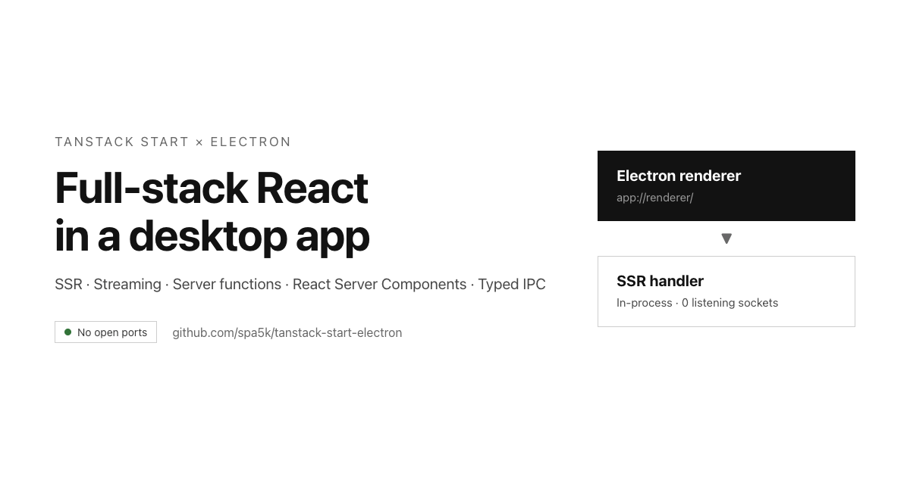

Desktop apps deserve the same tools as web apps. TanStack Start gives you typed routing, server-side
rendering, server functions, and React Server Components. Electron gives you the desktop.

This project joins them. It is a production-ready starter: the same server code runs in Electron and
on Node, the renderer is sandboxed, the IPC bridge is fully typed, and `pnpm dist` produces an
installer with no `node_modules` inside.

It is also the successor to my Next.js App Router + Electron boilerplate.

---

## What you get

- **File-based routing** with TanStack Router. Routes are typed, end to end.
- **SSR and hydration** with a real server render, not a static `index.html`.
- **Streaming** with deferred loader data and Suspense.
- **Server functions** — typed RPC with zod validation and no API layer.
- **Server-only modules** that can never leak into the client bundle.
- **Server routes** for webhooks, health checks, and downloads.
- **React Server Components** (experimental) with client slots.
- **A typed IPC bridge** over `contextBridge`, with a sandboxed renderer.
- **No open ports** in the default production mode.
- **Packaging** for macOS, Windows, and Linux with electron-builder.
- **An end-to-end smoke test** that drives the real app.

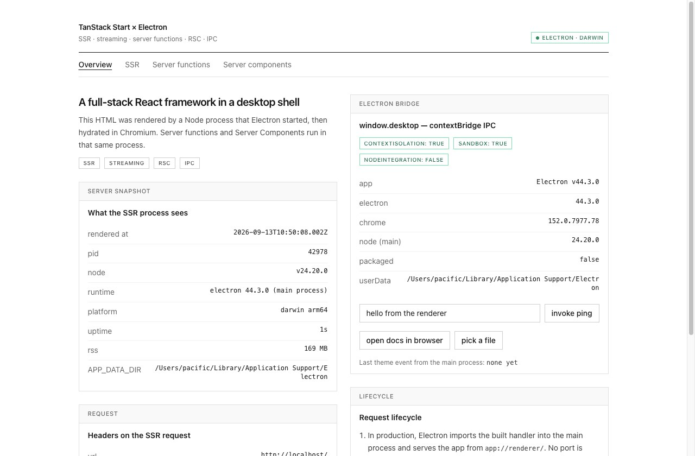

The overview page is server-rendered. Everything on it comes from the SSR process: the timestamps,
the request headers, the Node version. The panel on the right is the live IPC bridge.

---

## One handler, three hosts

The build produces a single fetch handler. Electron serves it in-process. A flag starts it as a child
process on a loopback port. Node serves it for the web version.

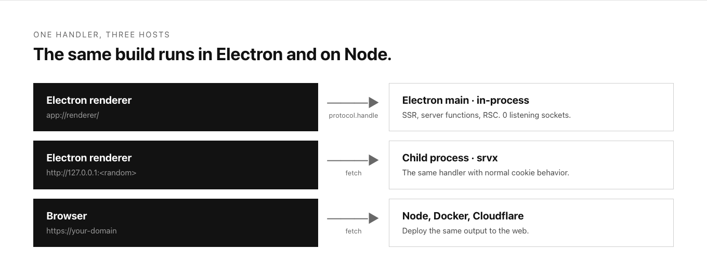

This shape keeps the project honest: the desktop app cannot drift away from the web app, because they
run the same code.

---

## The web app

### Routing

TanStack Router reads `src/routes` and generates `src/routeTree.gen.ts`. Add a file, get a route.
Links and navigation are type-checked, including path params and search params.

The root route renders the full `<html>` document through the `shellComponent` slot, with
`<HeadContent />` and `<Scripts />` from the router.

### SSR and hydration

Route loaders run on the server during SSR and on the client during navigation. Browser-only values —
like `window.desktop` — are read inside an effect so the server render and the first client render
agree:

```ts
export function useDesktop(): DesktopApi | null {
  const [desktop, setDesktop] = useState<DesktopApi | null>(null)
  useEffect(() => setDesktop(window.desktop ?? null), [])
  return desktop
}
```

Hydration mismatches are a class of bug you never see in this project.

### Streaming

The `/ssr` page returns a slow promise from its loader without awaiting it, then renders it with
`<Await>` inside `<Suspense>`. React sends the shell immediately and streams the rest when it
resolves.

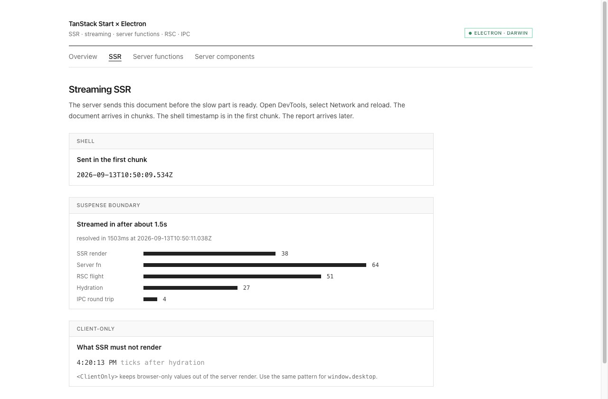

The timing is visible in the Network tab: the document arrives in chunks, and the report lands about
1.5 seconds later in the same response.

### Server functions

`createServerFn` turns a function into a typed RPC endpoint. During SSR it runs in the same process.
In the browser it becomes a network call. Zod schemas plug into `.validator()`.

```ts
export const incrementCounter = createServerFn({ method: 'POST' })
  .validator(z.object({ by: z.number().int().min(1).max(10) }))
  .handler(async ({ data }) => {
    const current = await readCounter()
    return writeCounter({ value: current.value + data.by })
  })
```

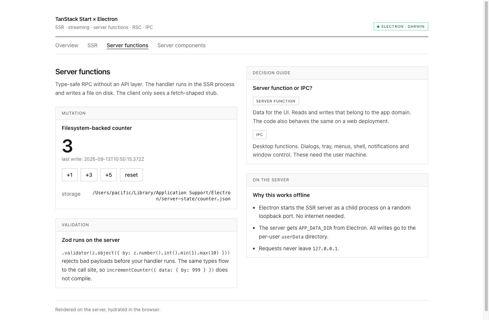

The counter writes a real file to Electron's `userData` directory. The path crosses the process
boundary through `APP_DATA_DIR`, so the same handler also works on a server.

### Server routes

For raw HTTP, add a `server` block to a route:

```ts
export const Route = createFileRoute('/api/health')({
  server: { handlers: { GET: () => Response.json({ ok: true }) } },
})
```

Not everything needs RPC. Webhooks, file downloads, and health checks belong here.

### React Server Components

RSC is experimental and enabled with one plugin flag. Server components render to a Flight payload
and never ship their code to the browser. Client islands arrive through slots:

```tsx
<CompositeComponent src={card.src} renderStamp={...}>
  <SlotCounter label="children slot" />
</CompositeComponent>
```

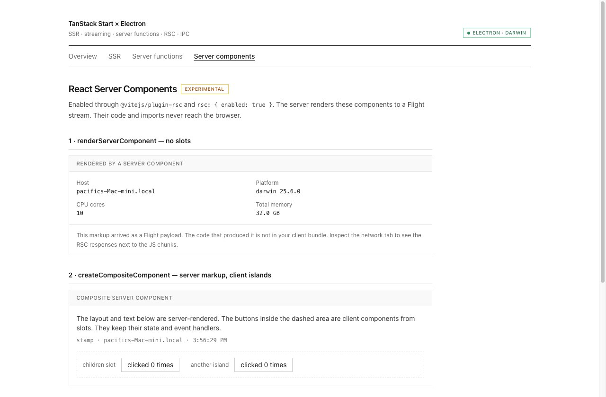

The page mixes server-rendered markup with interactive client components. The bundle stays small,
because the heavy code never leaves the server.

---

## The desktop layer

### A typed IPC bridge

`src/lib/desktop-contract.ts` is the single source of truth for channels and payload types. The
preload script, the main process, and the renderer all import it.

```ts
contextBridge.exposeInMainWorld('desktop', {
  platform: process.platform,
  invoke: {
    appInfo: () => ipcRenderer.invoke(IPC.invoke.appInfo),
    ping: (message) => ipcRenderer.invoke(IPC.invoke.ping, message),
  },
  on: (event, listener) => { /* subscribe, and return an unsubscribe function */ },
})
```

The renderer calls `window.desktop.invoke.ping('hello')` and gets a typed result. The main process
treats every argument as untrusted input.

### Security defaults

- `contextIsolation: true` — page JavaScript cannot touch the preload realm.
- `sandbox: true` — the renderer runs in the operating system sandbox.
- `nodeIntegration: false` — no `require` and no `process` in the page.
- A navigation guard that blocks other origins and opens external links in the system browser.

---

## Production

### The build

```
pnpm build
  ├─ vite build
  │    ├─ .output/public/          # client assets
  │    ├─ .output/server/index.mjs # fetch handler (Nitro standard preset)
  │    └─ .output/nitro.json
  └─ tsup → build/main.cjs, build/preload.cjs, build/serve.cjs
```

The handler is a plain `default { fetch }` export. Static asset serving stays in the bundle.

### No open ports by default

Electron imports the handler into the main process. A privileged `app://` scheme answers every
request from the renderer.

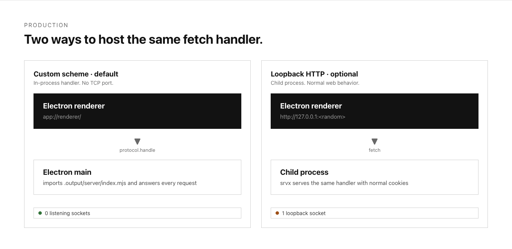

No child process. No TCP port. And a nice side effect: server functions run in the main process, so
they can call Electron APIs directly.

You can verify it while the app runs:

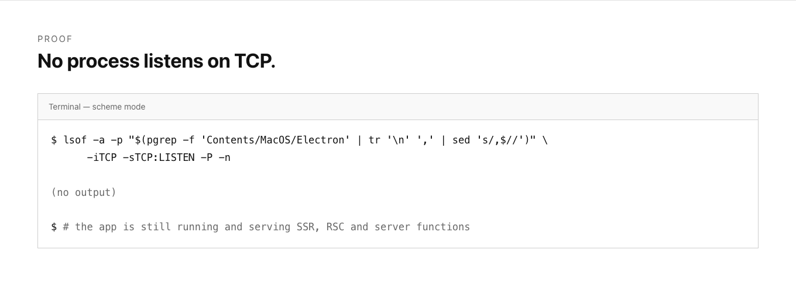

### Two hosting modes

Both modes ship in the same build:

- **Custom scheme — `pnpm start`.** No ports. In-process handler. Server code can use Electron APIs.
- **Loopback HTTP — `ELECTRON_USE_HTTP_SERVER=1 pnpm start`.** A child process on a random
  `127.0.0.1` port. Normal cookies and a debuggable URL.

The scheme mode is the default because it is the safer and faster one. The HTTP mode is the escape
hatch for apps that need normal web behavior.

### Packaging

`electron-builder.yml` ships the main bundle in the ASAR and the handler as unpacked resources:

```
Contents/Resources/
├── app.asar        ~50 KB   (main, preload, package.json)
└── app-server/     ~2.4 MB  (handler, client assets, serve.cjs)
```

No `node_modules`. The installer stays small and the app starts fast.

---

## Testing

The project includes a smoke test that drives the real renderer through
`webContents.executeJavaScript`. One command checks the whole stack:

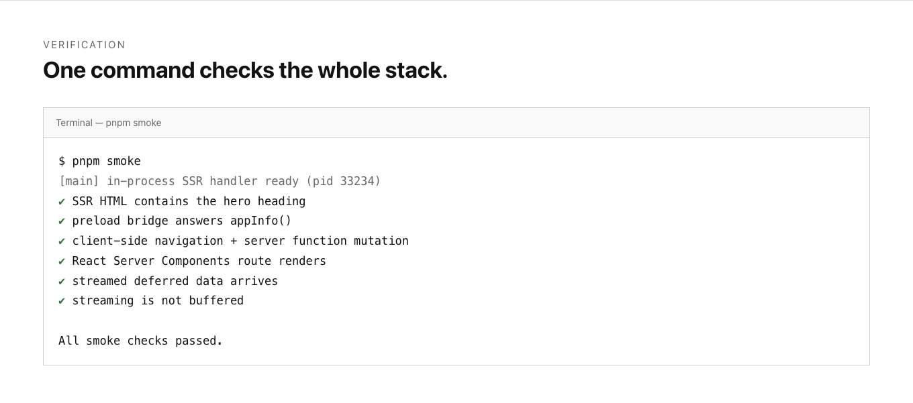

It covers server-rendered HTML, the IPC bridge, client navigation with a server-function mutation,
RSC rendering, streamed data, and a timing check that fails if streaming is buffered. It runs in CI
with `xvfb-run -a pnpm smoke`.

---

## Development

Development stays normal. `pnpm dev` runs the Vite dev server with full HMR, and the main process
restarts when you change it.

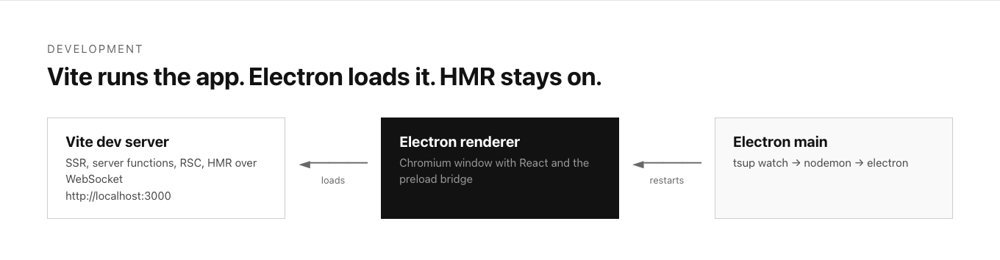

---

## Getting started

```bash
git clone git@github.com:spa5k/tanstack-start-electron.git
cd tanstack-start-electron
pnpm install
pnpm dev      # desktop app with HMR
pnpm start    # production build, no open ports
pnpm smoke    # six checks against the real app
```

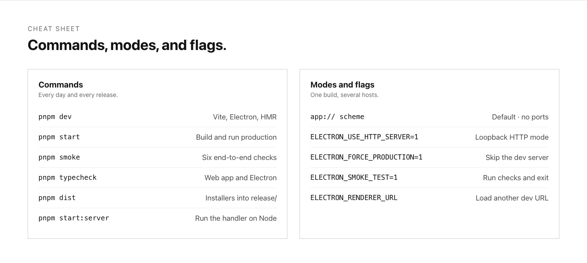

The repository: **https://github.com/spa5k/tanstack-start-electron**

---

## Design notes

A few choices are worth knowing before you extend the project.

- **The handler sees `http://localhost` as its origin.** Custom schemes have a null origin, and
  TanStack Start normalizes URLs with `new URL(...)`. The protocol layer rewrites requests to a
  synthetic origin, and rewrites the `Origin` and `Referer` headers to match, so the CSRF middleware
  accepts same-origin calls. Use relative URLs in server code.
- **Cookies need a jar on custom schemes.** Chromium blocks cookies for `app://`. A small in-memory
  jar adds a `Cookie` header and stores `Set-Cookie` headers, so server sessions work.
  `document.cookie` stays empty. Use the HTTP mode if your app depends on it.
- **Server code can use Electron APIs.** The handler runs in the main process. Guard those imports
  if you also build for the web.
- **The web version is not an afterthought.** `node scripts/serve.mjs` runs the same handler with
  `srvx`. Cloudflare, Netlify, and Vercel work through their Nitro presets.

---

## Limitations

- **RSC is experimental.** The API can change, and it is behind a flag.
- **Nitro is a beta dependency** at this version. Pin it.
- **Custom scheme limits are real.** The README has the full list.
- **Signing and icons** are not included. Bring your own certificate.

---

*Built with [TanStack Start](https://tanstack.com/start), [Nitro](https://nitro.build), and
[Electron](https://www.electronjs.org/).*

<!--
PUBLISHING NOTES (delete before posting)

Use blog/og.png (1200×630) as the featured image and social preview.

Body images, in order:
  1. screenshots/overview.jpg          (What you get)
  2. blog/hosts.png                    (One handler, three hosts)
  3. screenshots/streaming-ssr.jpg     (Streaming)
  4. screenshots/server-functions.jpg  (Server functions)
  5. screenshots/server-components.jpg (RSC)
  6. blog/prod-flow.png                (No open ports)
  7. blog/no-ports.png                 (lsof proof)
  8. blog/smoke.png                    (Testing)
  9. blog/dev-flow.png                 (Development)
 10. blog/cheatsheet.png               (Getting started)

Tags: Electron, React, TypeScript, Web Development, JavaScript
-->
